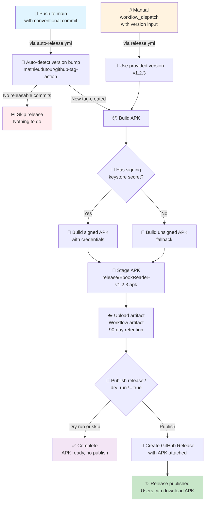
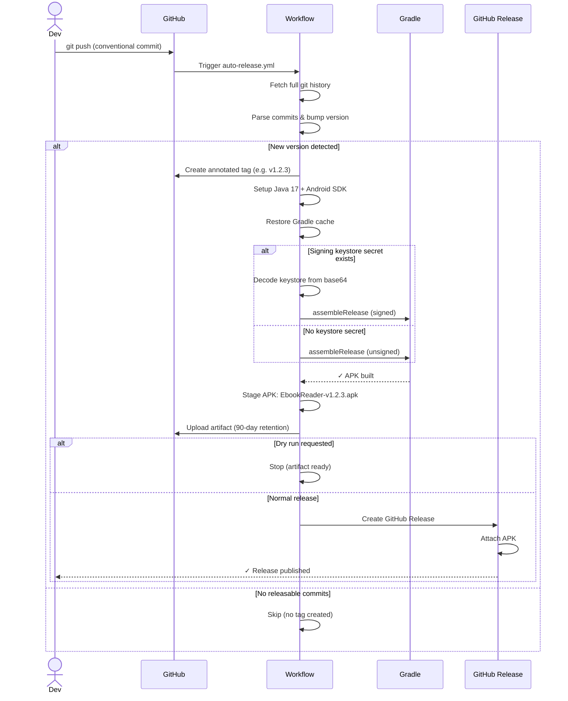
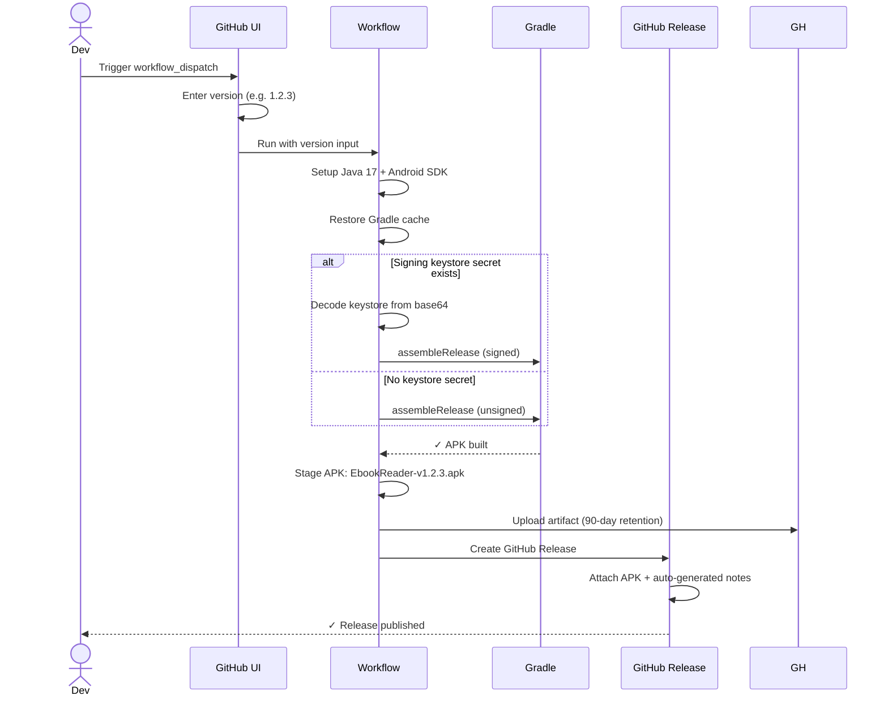
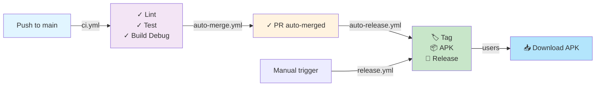
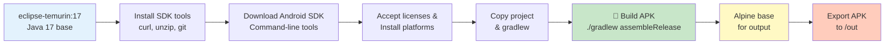

# Release Process — EbookReader

Comprehensive guide to the automated APK release workflow for EbookReader.

---

## Overview

The project uses two complementary workflows to automate APK creation and GitHub Release publishing:

1. **Auto Release** (`auto-release.yml`) — Automatic on every push to `main`
2. **Manual Release** (`release.yml`) — On-demand via `workflow_dispatch`

Both workflows follow **semantic versioning** based on conventional commit messages.

---

## Release Workflow Diagram



---

## Versioning Rules (Semantic Versioning)

The tag action automatically bumps the version based on commit message prefixes:

| Commit Prefix | Version Bump | Example |
|---|---|---|
| `feat!:` or `BREAKING CHANGE` | **Major** | v1.0.0 → v2.0.0 |
| `feat:` | **Minor** | v1.0.0 → v1.1.0 |
| `fix:`, `perf:`, `refactor:` | **Patch** | v1.0.0 → v1.0.1 |
| `chore:`, `docs:`, `ci:`, `style:` | **Patch** | v1.0.0 → v1.0.1 |

**No matching prefix** → No tag created → No release.

---

## Automatic Release Flow (`auto-release.yml`)

Triggered on every push to `main` branch.



**Key Points:**
- ✅ Runs on every push to `main`
- 🔐 Automatically handles signing (if secrets configured)
- 📦 Uploads artifact regardless of publish
- 🔧 Manual `dry_run` input for testing without publishing
- ✨ GitHub Release includes changelog from commits

---

## Manual Release Flow (`release.yml`)

Triggered manually via **Actions tab** → **Manual Release APK** → **Run workflow**.



**Key Points:**
- 🖱️ Manual trigger from GitHub UI (or API)
- 📋 Accepts custom version number
- 🔐 Automatically handles signing (if secrets configured)
- 📦 Always publishes (no dry-run option)
- 📝 Auto-generates release notes from commits since last tag

---

## APK Output Details

### Artifact Storage

| Location | Purpose | Retention |
|---|---|---|
| `app/build/outputs/apk/release/` | Gradle build output | Local build only |
| `release/` | Staged during workflow | Workflow artifact (90 days) |
| GitHub Release | User-facing download | Indefinite |

### APK Naming Convention

```
EbookReader-v1.2.3.apk
├─ Product: EbookReader
├─ Version: 1.2.3 (semver)
└─ Format: Android Release APK
```

**Version Code** (internal Android) = `github.run_number` (workflow run count)  
**Version Name** (user-facing) = Git tag (e.g. `v1.2.3`)

---

## Signing Configuration

### Signed Release (Recommended)

Requires **three GitHub repository secrets**:

| Secret | Purpose |
|---|---|
| `SIGNING_KEYSTORE_BASE64` | Base64-encoded `.jks` keystore |
| `SIGNING_STORE_PASSWORD` | Keystore password |
| `SIGNING_KEY_ALIAS` | Key alias in keystore |
| `SIGNING_KEY_PASSWORD` | Key password |

**Setup:**
```bash
# Encode keystore to base64
base64 -i my-key.jks | tr -d '\n' | pbcopy

# Add to GitHub Secrets:
# Settings → Secrets → New repository secret
# SIGNING_KEYSTORE_BASE64 = (paste output)
```

✅ **Signed APKs** can be installed directly on any device.

### Unsigned Fallback

If secrets are not configured, the workflow **automatically builds an unsigned APK**.

⚠️ **Unsigned APKs** require enabling **Install from unknown sources** in Android Settings.

---

## Commit Message Examples

### Automatic Release Triggers

```bash
# Minor version bump (v1.0.0 → v1.1.0)
git commit -m "feat: add night mode toggle"

# Patch version bump (v1.0.0 → v1.0.1)
git commit -m "fix(epub): handle missing OPF rootfile"

# Patch version bump (no trigger without prefix)
git commit -m "ci: add setup-android to lint job"

# Major version bump (v1.0.0 → v2.0.0)
git commit -m "feat!: redesign reader interface"
# or
git commit -m "feat: redesign reader interface

BREAKING CHANGE: old API no longer supported"
```

### No Release Trigger

```bash
# Does NOT trigger release (no version bump)
git commit -m "Update documentation"

# Also does NOT trigger (must use conventional commit prefix)
git commit -m "random commit message"
```

---

## Workflow Outputs

### On Success

```
✅ Release published successfully

Location: https://github.com/azertytr/ebooks/releases/tag/v1.2.3
Download: EbookReader-v1.2.3.apk (attached to release)
Artifacts: Available on Actions tab (90-day retention)
```

### On Failure

Check the **Actions tab** for detailed logs:

1. **Tag creation failed** → Check commit history and `git log`
2. **Build failed** → Check Gradle output in workflow logs
3. **Release creation failed** → Check GitHub permissions and secrets
4. **APK not found** → Gradle output path mismatch (unlikely)

---

## Troubleshooting

### No Release Created After Push to `main`

**Cause:** Commit message doesn't match conventional commit format.

**Fix:** Ensure commit starts with one of: `feat:`, `fix:`, `docs:`, `style:`, `refactor:`, `test:`, `chore:`, `ci:`, `build:`, `perf:`

```bash
git log --oneline | head -1
# Output: feat: add night mode  ✅ Will trigger
# Output: Update docs          ❌ Will not trigger
```

### APK Unsigned When It Should Be Signed

**Cause:** `SIGNING_KEYSTORE_BASE64` secret is not set or empty.

**Fix:** 
1. Verify the secret exists in GitHub Settings → Secrets
2. Verify it's not empty (common mistake with copy-paste)
3. Trigger the workflow manually to verify signing

### Artifact Not in GitHub Release

**Cause:** Rare — usually indicates a race condition in `softprops/action-gh-release`.

**Fix:** Check the workflow log for the exact error, then manually re-run the workflow.

---

## Integration with CI/CD

The release workflow integrates with other automation:



---

## Security Considerations

### Keystore Protection

- ✅ Keystore **never committed** to repo (in `.gitignore`)
- ✅ Keystore encoded as base64 secret (GitHub automatically masks in logs)
- ✅ Only decoded **inside** the workflow runner (not exposed)
- ✅ Removed after build (temporary file)

### Secret Scope

- `SIGNING_KEYSTORE_BASE64` — Repository secret (accessible to all workflows)
- All other signing secrets — Repository secret (same access level)

**Best Practice:** Use minimal secret permissions and audit GitHub Actions logs regularly.

---

## Advanced: Dry Run Testing

Test the full release flow without publishing:

```bash
# Via GitHub UI:
# 1. Actions → Auto Release → Run workflow
# 2. Check "Dry run"
# 3. Run

# Via gh CLI:
gh workflow run auto-release.yml -f dry_run=true
```

Result:
- ✅ Tag created
- ✅ APK built and signed
- ✅ Artifact uploaded
- ❌ Release **not** published

---

## Building APK Locally

### Option 1: Docker (Recommended)

Use Docker to build APK in an isolated environment matching the CI/CD pipeline.

```bash
# Build with default version (v1.0.0)
./scripts/build-apk-docker.sh

# Build with custom version
./scripts/build-apk-docker.sh 1.2.3

# Build with version and code
./scripts/build-apk-docker.sh 1.2.3 42
```

**Advantages:**
- ✅ No Android SDK installation needed
- ✅ Reproducible builds (matches CI exactly)
- ✅ Works on any OS with Docker
- ✅ Clean isolation

**Output:** `./release/EbookReader-v1.2.3.apk`

### Option 2: Local Gradle

Build APK using your local Android SDK and Gradle.

```bash
# Debug APK
./gradlew assembleDebug
# Output: app/build/outputs/apk/debug/app-debug.apk

# Release APK (unsigned)
./gradlew assembleRelease
# Output: app/build/outputs/apk/release/app-release-unsigned.apk

# Release APK with version parameters
./gradlew assembleRelease \
  -PVERSION_CODE=42 \
  -PVERSION_NAME=v1.2.3
```

**Advantages:**
- ✅ Faster incremental builds
- ✅ Better IDE integration
- ✅ Direct control over build parameters

**Requirements:**
- JDK 17+
- Android SDK 34+
- Gradle 8.7+

---

## Docker Build Details

### Dockerfile Architecture



### Build Arguments

```bash
# VERSION_CODE — internal Android version (auto-increment)
docker build --build-arg VERSION_CODE=42 ...

# VERSION_NAME — user-facing version (semantic)
docker build --build-arg VERSION_NAME=v1.2.3 ...
```

### Output Locations

Inside Docker:
- **Build output:** `/app/app/build/outputs/apk/release/`
- **Exported APK:** `/out/` (copied to host)

On host:
- **Host path:** `./release/EbookReader-v*.apk`

---

## Related Documentation

- [README.md](./README.md) — Installation & usage instructions
- [CLAUDE.md](./CLAUDE.md) — Project architecture and conventions
- [Dockerfile](./Dockerfile) — Docker build configuration
- [scripts/build-apk-docker.sh](./scripts/build-apk-docker.sh) — Docker build script
- [.github/workflows/auto-release.yml](./.github/workflows/auto-release.yml) — Automatic release implementation
- [.github/workflows/release.yml](./.github/workflows/release.yml) — Manual release implementation
- [SECURITY.md](./SECURITY.md) — Security policy for signing secrets
